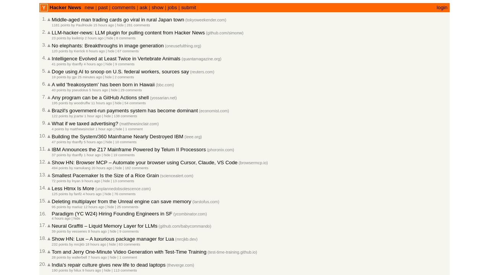

# Automated-Debug
Uh oh! You have a web application that displays real-time data from multiple sources. Sometimes, the data fails to update correctly, or there are discrepancies in the values. 
Let's automate the detection of these issues, capture them with screenshots, and provide a summary of what might be causing the problem... lets throw in some Ai too ;

This project uses [Microsoft Playwright](https://playwright.dev/) to automatically check the **Hacker News** homepage for potential headline issues. If a bug is detected (like a short or missing headline), a screenshot is captured automatically for debugging.

---

## 🛠️ Project Setup

### 1. Initialize your Node.js project
```bash
npm init -y
```

### 2. Install Playwright Test
```bash
npm install --save-dev @playwright/test
```

---

## 📂 Project Structure

```
.
├── playwright.config.js           # Playwright configuration file
└── tests/
    └── bugChecker.spec.js         # Our main test script
```

---

## 🚀 Running the Test

To execute the script:
```bash
npx playwright test
```

If the headline on Hacker News is shorter than expected, the test fails and saves a screenshot like this:



> ✅ If the headline is valid, the test will simply pass.

---

## 🧪 What the Script Does

1. Opens [https://news.ycombinator.com](https://news.ycombinator.com)
2. Extracts the first post headline
3. Checks its length (we set an intentionally high threshold to simulate bugs)
4. On failure:
   - Takes a screenshot
   - Fails the test
   - Saves full trace and video (great for debugging!)

---

## 🔍 Bonus Debugging Tools

After a failed run, Playwright also stores:
- 📸 `test-results/` folder with screenshots and videos
- 🕵️ A trace file you can view with:

```bash
npx playwright show-trace test-results/<your-trace-file>.zip
```

---

